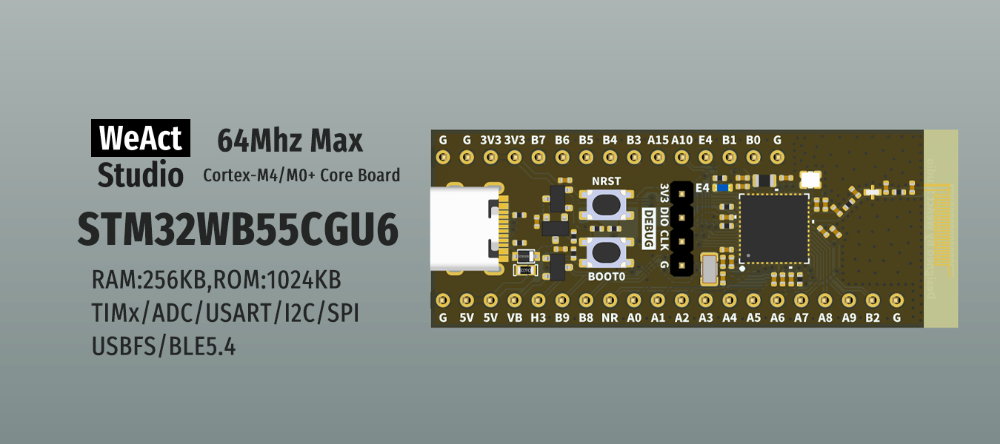

* [中文版本](./README_zh.md)
# WeActStudio.STM32WB55CoreBoard

STM32WB55CGU6
> 64Mhz Max,256KB RAM,1024KB ROM

> The factory default burning `stm32wb5x_BLE_Stack_full_fw.bin` protocol stack,v1.19.0.2

ST Official Website www.st.com

|Dir Name|Explain|
| :--:|:--:|
|Doc|DataSheet/ReferenceManual|
|Hardware|Hardware Development Kit|
|Examples|Software Examples|

```
/*---------------------------------------
- WeAct Studio Official Link
- taobao: weactstudio.taobao.com
- aliexpress: weactstudio.aliexpress.com
- github: github.com/WeActStudio
- gitee: gitee.com/WeAct-TC
- blog: www.weact-tc.cn
---------------------------------------*/
```
