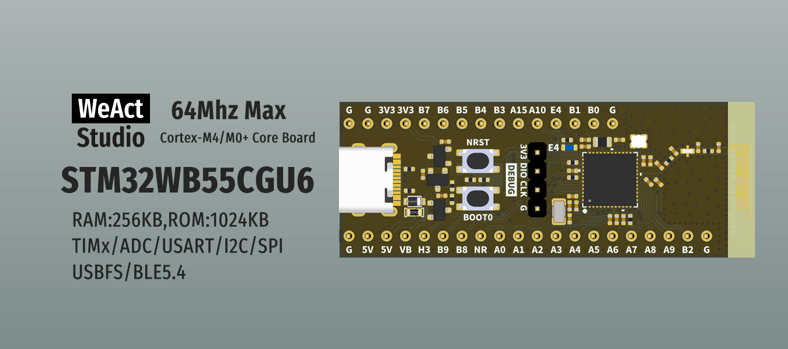

* [English version](./README.md)
# WeActStudio.STM32WB55CoreBoard

STM32WB55CGU6
> 64Mhz Max,512KB RAM,1024KB ROM

> 出厂默认烧录`stm32wb5x_BLE_Stack_full_fw.bin`协议栈，v1.19.0.2

ST 官方网站 www.st.cn

|目录名称|内容|
| :--:|:--:|
|Doc| 数据手册/参考手册|
|Hardware| 硬件开发资料|
|Examples|软件例程|

```
/*---------------------------------------
- WeAct Studio Official Link
- taobao: weactstudio.taobao.com
- aliexpress: weactstudio.aliexpress.com
- github: github.com/WeActStudio
- gitee: gitee.com/WeAct-TC
- blog: www.weact-tc.cn
---------------------------------------*/
```